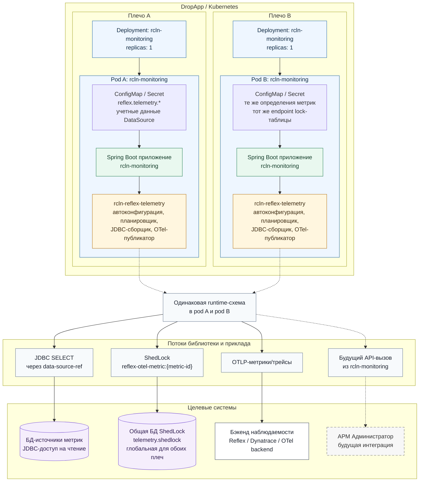
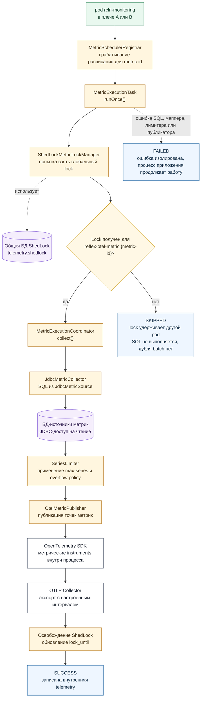

# Архитектура rcln-monitoring с rcln-reflex-telemetry в DropApp/Kubernetes

Документ описывает целевое размещение приклада `rcln-monitoring`, который подключает библиотеку `rcln-reflex-telemetry` и запускает плановый JDBC-сбор метрик из БД. Приклад развернут в двух плечах DropApp/Kubernetes. Для каждой JDBC-метрики используется глобальная координация через общую таблицу ShedLock: в один момент времени конкретный `metric-id` выполняет только один pod из обоих плеч.

## Термины на диаграммах

| Термин | Значение |
| ------ | -------- |
| `rcln-monitoring` | Spring Boot приклад-потребитель библиотеки. |
| `rcln-reflex-telemetry` | Spring Boot starter внутри процесса `rcln-monitoring`: автоконфигурация, планировщик, JDBC-сборщик, OTel-публикатор. |
| `БД-источники метрик` | БД, к которым библиотека ходит JDBC-запросами на чтение через `data-source-ref`. |
| `Общая БД ShedLock` | Общая техническая БД/схема с таблицей `telemetry.shedlock`, доступная pod-ам обоих плеч. |
| `OTLP Collector` | Принимает OTLP-метрики/трейсы от pod-ов и передает их в бэкенд наблюдаемости. |
| `АРМ Администратор` | Будущая интеграция приклада, показана пунктиром и не является частью текущего OTLP-пайплайна. |

## Топология размещения и выполнения

## Плановый запуск JDBC-метрики

## Консистентность и инварианты

1. `БД-источники метрик` на обеих схемах означает только БД, из которых читаются метрики. Это не lock-БД и не бэкенд наблюдаемости.
2. `Общая БД ShedLock` на обеих схемах означает одну общую lock-таблицу для pod-ов обоих плеч. Если lock недоступен, pod не выполняет SQL и не публикует batch метрики.
3. `OTLP Collector` на обеих схемах означает приемник OTLP-метрик/трейсов. Он не участвует в JDBC-сборе и не координирует scheduler.
4. `АРМ Администратор` показан пунктиром как будущая интеграция приклада `rcln-monitoring`, а не как часть текущей библиотеки `rcln-reflex-telemetry`.
5. Внутри каждого pod работает собственный scheduler, но глобальный ShedLock превращает запуск конкретной JDBC-метрики в single-run по обоим плечам.
